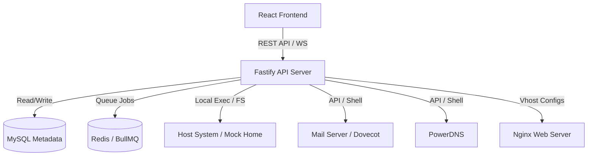

# cPanel Clone - Backend & API Documentation

This directory documents the backend architecture, services, database schema, and REST API endpoints for the cPanel Clone application.

---

## 🛠️ Architecture Overview

The backend is built as a modular REST API using **Fastify** (Node.js) and **TypeScript**. It connects to a **MySQL** database for state metadata management, **Redis** (via BullMQ) for background provisioning jobs, and interfaces directly with system services (Nginx, PowerDNS, system users, Dovecot, Postfix) to simulate a complete web hosting control panel environment.



---

## 🔑 Authentication & Authorization

All `/cpanel/*` API endpoints require a JSON Web Token (JWT) passed in the `Authorization` header:

```http
Authorization: Bearer <JWT_TOKEN>
```

- **Admin Role:** Access to all client accounts, WHM controls, and backend status.
- **User Role:** Bound strictly to the account owner's ID and isolated Unix home directory (`/home/username`).

---

## 🗄️ Database Schema

The cPanel Clone relies on a Knex-managed relational schema stored in the `cpanel_clone` database:

### 1. `accounts`
Stores cPanel user accounts:
- `id` (UUID): Primary Key
- `username` (String): Unix system username
- `home_dir` (String): Absolute path to the user's home directory (e.g. `/home/zanaen`)
- `primary_domain` (String): Root domain mapped to this account

### 2. `domains`
Configured addon domains, subdomains, and redirects:
- `id` (UUID): Primary key
- `account_id` (UUID): Foreign key referencing `accounts`
- `domain` (String): Fully qualified domain name (e.g. `example.com`)
- `document_root` (String): Directory containing the web files (e.g. `/home/zanaen/public_html`)
- `type` (String): `addon`, `subdomain`, or `redirect`

### 3. `mysql_databases`
Tracks database ownership:
- `id` (UUID): Primary key
- `account_id` (UUID): References `accounts`
- `db_name` (String): Actual MySQL database name on server (formatted as `username_dbname`)

### 4. `wordpress_installations`
Monitors active WordPress sites managed by the Toolkit:
- `id` (UUID): Primary key
- `account_id` (UUID): References `accounts`
- `domain` (String): Domain mapped to the site
- `path` (String): Installation folder inside home directory
- `site_title` (String): Display title
- `db_name` (String): Associated MySQL database
- `status` (String): `active` or `suspended`

---

## 📡 REST API Reference

### 📁 File Manager API

#### 1. List Files
* **Endpoint:** `GET /cpanel/files/list`
* **Query Parameters:**
  - `relPath` (String, optional): Directory relative path inside user's home. Defaults to root.
* **Response (200 OK):**
  ```json
  {
    "currentDir": "public_html",
    "items": [
      {
        "name": "index.html",
        "isDirectory": false,
        "size": 420,
        "updatedAt": "2026-06-03T09:36:12Z",
        "relPath": "public_html/index.html",
        "permissions": "0644"
      }
    ]
  }
  ```

#### 2. Create File or Folder
* **Endpoint:** `POST /cpanel/files/create`
* **Body Parameters:**
  - `relPath` (String): Destination parent directory relative path.
  - `name` (String): Name of the file or folder to create.
  - `isDirectory` (Boolean): Set to `true` to create a folder, `false` for a file.

#### 3. Write / Save File
* **Endpoint:** `POST /cpanel/files/write`
* **Body Parameters:**
  - `relPath` (String): File path.
  - `content` (String): Text contents to save.

#### 4. Read File Content
* **Endpoint:** `GET /cpanel/files/read`
* **Query Parameters:**
  - `relPath` (String): Relative path to the file.
* **Response (200 OK):**
  ```json
  {
    "content": "body { background: #fff; }"
  }
  ```

#### 5. Permissions (Chmod)
* **Endpoint:** `POST /cpanel/files/chmod`
* **Body Parameters:**
  - `relPath` (String): Target resource path.
  - `mode` (String): Permissions string in octal format (e.g. `"0755"`, `"0644"`).

#### 6. Copy / Move Resource
* **Endpoint:** `POST /cpanel/files/copy` (or `/cpanel/files/move`)
* **Body Parameters:**
  - `relPath` (String): Source file or folder.
  - `destRelPath` (String): Destination path.

---

### 📝 WordPress Toolkit API

#### 1. List Installations
* **Endpoint:** `GET /cpanel/wordpress/installations`
* **Response (200 OK):**
  ```json
  [
    {
      "id": "a1b2c3d4-e5f6...",
      "domain": "zanaen.com",
      "path": "/home/zanaen/public_html",
      "site_title": "My Blog",
      "admin_user": "admin",
      "db_name": "zanaen_wp123",
      "version": "6.4.2",
      "status": "active"
    }
  ]
  ```

#### 2. Quick Install WordPress
* **Endpoint:** `POST /cpanel/wordpress/install`
* **Body Parameters:**
  - `domain` (String): Installation target domain.
  - `installDir` (String, optional): Subfolder directory inside public_html (e.g. `blog`).
  - `siteTitle` (String): Header title.
  - `adminUser` (String): CMS user login.
  - `adminPass` (String): Security password.
* **Behavior:** Automatically allocates a database, generates a secure random password, creates a MySQL database user, grants privileges, writes custom mock `index.php` and `wp-config.php` files to disk, and tracks the metadata state.

#### 3. Uninstall WordPress
* **Endpoint:** `POST /cpanel/wordpress/uninstall`
* **Body Parameters:**
  - `id` (UUID): WordPress installation identifier.
* **Behavior:** Drops the associated database, removes system users, cleans up directory contents from the server, and deletes the database tracker entry.
